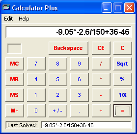



## An MS Calculator Replica with several extra Features

### Description

Features Include:

Unlimited Operations on one line – Calculator Plus allows you to type out your equation and can view it all in one line. The solve function follows order of operation rules and can handle any number of operators on one line.

Last Solved Line – Displays the last equation you just solved. Helpful if you forget what you had just calculated.

+/- Button – Works on any number in the equation, can appear multiple times in one equation, and is correctly processed by the solver.

CE Button – Clears the last number entered without erasing the entire equation.

Edit – Copy Function – Sets the current equation to the clipboard for pasting.

Memory Functions – Memory recall correctly places the current number stored in memory to the end of the current equation.

Supports Keyboard input – Focus can be anywhere on the calculator and keyboard events will still be processed into the calculator.

Accurate Formatting – Calculator Plus corrects input errors on the fly to avoid solving errors later (removes zeros from an input number, etc.)
 
### More Info
 

             |
---                |---
**Submitted On**   |2002-12-01 20:03:10
**By**             |[Fire Software](https://github.com/Planet-Source-Code/PSCIndex/blob/master/ByAuthor/fire-software.md)
**Level**          |Intermediate
**User Rating**    |5.0 (15 globes from 3 users)
**Compatibility**  |VB 6\.0
**Category**       |[Complete Applications](https://github.com/Planet-Source-Code/PSCIndex/blob/master/ByCategory/complete-applications__1-27.md)
**World**          |[Visual Basic](https://github.com/Planet-Source-Code/PSCIndex/blob/master/ByWorld/visual-basic.md)
**Archive File**   |[An\_MS\_Calc1506321212002\.zip](https://github.com/Planet-Source-Code/fire-software-an-ms-calculator-replica-with-several-extra-features__1-41209/archive/master.zip)

